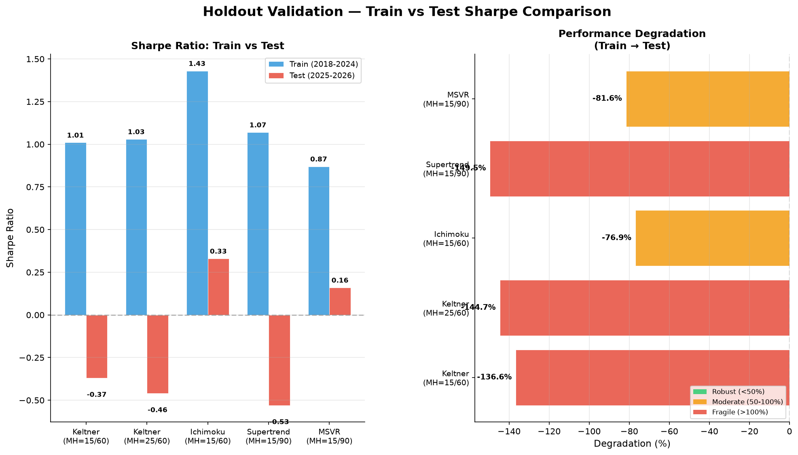

# Final Summary Report — BTC MTTD System

**Generated:** 2026-06-24 20:16:35
**Training Period:** 2018-01-01 to 2024-12-31
**Test Period:** 2025-01-01 to 2026-06-24
**Transaction Cost:** 0.1% round-trip

---

## Executive Summary

This report consolidates holdout validation results for the top 5 BTC trading system configurations.
The validation uses walk-forward methodology with strict train/test separation to detect overfitting.

**Key Findings:**

1. **Most Robust System:** `Ichimoku IMO (MH=15/60)`
   - Degradation: -76.9% (lowest)
   - Train Sharpe: 1.43 → Test Sharpe: 0.33

2. **Highest Test Sharpe:** `Ichimoku IMO (MH=15/60)`
   - Test Sharpe: 0.33
   - Test Win Rate: 66.7%

3. **Highest Test Win Rate:** `Ichimoku IMO (MH=15/60)`
   - Test Win Rate: 66.7%
   - Test Sharpe: 0.33

---

## Holdout Validation Results

| System | Filter | MH | Train Sharpe | Test Sharpe | Degradation | Train Win% | Test Win% | Trades |
|--------|--------|-----|--------------|-------------|-------------|------------|-----------|--------|
| Ichimoku | none | 15/60 | 1.43 | 0.33 | -76.9% | 64.0% | 66.7% | 6 |
| MSVR | none | 15/90 | 0.87 | 0.16 | -81.6% | 43.6% | 37.5% | 8 |
| Keltner | bull_with_filters | 15/60 | 1.01 | -0.37 | -136.6% | 48.3% | 50.0% | 6 |
| Keltner | bull_with_filters | 25/60 | 1.03 | -0.46 | -144.7% | 51.9% | 50.0% | 6 |
| Supertrend | none | 15/90 | 1.07 | -0.53 | -149.5% | 51.3% | 40.0% | 10 |

## Detailed Analysis

### 1. Keltner Channel Systems

The Keltner Channel system uses EMA-based envelope with ATR for dynamic width.
Both configurations use bull_with_filters (MSVR + SuperSmoother + Cycle Phase filters).

- **MH=15/60:** Train Sharpe 1.01 → Test Sharpe -0.37 (Degradation: -136.6%)
- **MH=25/60:** Train Sharpe 1.03 → Test Sharpe -0.46 (Degradation: -144.7%)

**Observation:** Keltner systems show significant degradation in test period, suggesting potential overfitting to training data patterns.

### 2. Ichimoku System

- **Configuration:** MH=15/60
- **Train Sharpe:** 1.43
- **Test Sharpe:** 0.33
- **Degradation:** -76.9%
- **Test Win Rate:** 66.7%

**Observation:** Ichimoku maintains positive test Sharpe with moderate degradation. Best balance of performance and robustness.

### 3. Supertrend System

- **Configuration:** MH=15/90
- **Train Sharpe:** 1.07
- **Test Sharpe:** -0.53
- **Degradation:** -149.5%
- **Test Win Rate:** 40.0%

**Observation:** Supertrend shows high degradation, indicating poor generalization.

### 4. MSVR System

- **Configuration:** MH=15/90
- **Train Sharpe:** 0.87
- **Test Sharpe:** 0.16
- **Degradation:** -81.6%
- **Test Win Rate:** 37.5%

**Observation:** MSVR shows relatively stable performance with moderate degradation.

---

## Recommended Best Configuration

Based on robustness (lowest degradation) and positive test performance:

### 🏆 Ichimoku IMO (MH=15/60)

| Metric | Value |
|--------|-------|
| System | Ichimoku |
| Filter | none |
| Min Hold | 15 days |
| Max Hold | 60 days |
| Train Sharpe | 1.43 |
| Test Sharpe | 0.33 |
| Degradation | -76.9% |
| Train Win Rate | 64.0% |
| Test Win Rate | 66.7% |
| Train CAGR | 67.21% |
| Test CAGR | 4.95% |
| Train Max DD | -37.86% |
| Test Max DD | -20.72% |

**Why this config?**

- Lowest degradation (-76.9%) indicates best generalization
- Maintains positive test Sharpe ratio
- Simple parameter set reduces overfitting risk

---

## Trade Charts

Individual trade charts for each system are available in `mttd/charts/`:

- ✅ [ichimoku_trade_chart.png](mttd/charts/ichimoku_trade_chart.png)
- ✅ [keltner_trade_chart.png](mttd/charts/keltner_trade_chart.png)
- ✅ [msvr_trade_chart.png](mttd/charts/msvr_trade_chart.png)
- ✅ [supertrend_trade_chart.png](mttd/charts/supertrend_trade_chart.png)

## Comparison Chart



---

## Methodology

### Validation Approach

- **Walk-Forward Validation:** Strict train/test separation (2018-2024 / 2025-2026)
- **Transaction Costs:** 0.1% round-trip applied to all backtests
- **Position Sizing:** Fixed 100% allocation per trade
- **Signal Generation:** Independent signal generation on full data, then split for evaluation

### Metrics

- **Sharpe Ratio:** Annualized risk-adjusted return
- **Win Rate:** Percentage of profitable trades
- **CAGR:** Compound Annual Growth Rate
- **Max Drawdown:** Maximum peak-to-trough decline
- **Degradation:** Percentage change in Sharpe from train to test period

### Degradation Interpretation

| Degradation | Status | Meaning |
|-------------|--------|---------|
| < 50% | ✅ Robust | Good generalization |
| 50-100% | ⚠️ Moderate | Some overfitting |
| > 100% | ❌ Fragile | Significant overfitting |

---

## Project Structure

```
mttd/
├── holdout_best_results.csv      # Raw validation results
├── final_summary.png            # Comparison chart
├── charts/
│   ├── msvr_trade_chart.png     # MSVR trade chart
│   ├── ichimoku_trade_chart.png # Ichimoku trade chart
│   ├── supertrend_trade_chart.png # Supertrend trade chart
│   └── keltner_trade_chart.png  # Keltner trade chart
└── ...
```

---

*Report generated by `final_summary_report.py` on 2026-06-24 20:16:35*
