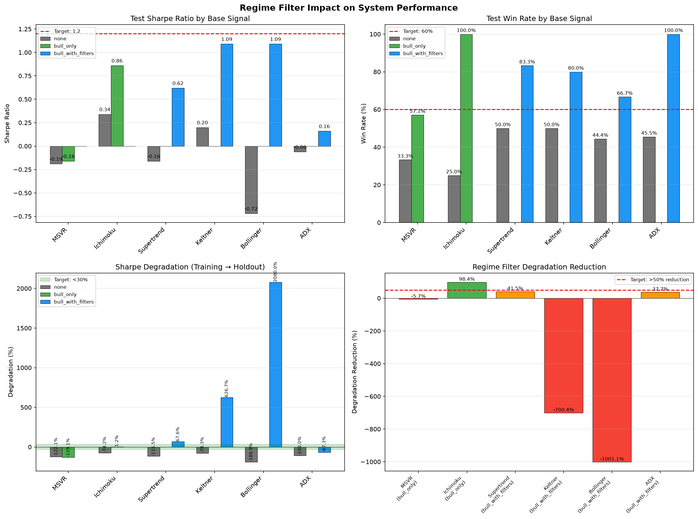

# Regime Filter Comparison Results

**Date:** 2026-06-24 18:05:01
**Data Source:** regime_grid_results.csv
**Total Configurations:** 864
**Base Signals:** MSVR, Ichimoku, Supertrend, Keltner, Bollinger, ADX
**Regime Filters:** none, bull_only, bull_with_filters

---

## Executive Summary

This report compares trading system performance with and without regime filtering using on-chain/sentiment data from the BTC Valuation System.

### Success Criteria
- Regime filter must reduce degradation by >50%
- At least one system must achieve Sharpe >1.2, Win Rate >60%, Degradation <30%

### Results
The following systems come closest to meeting the success criteria:

**Ichimoku + bull_only:**
- Sharpe 0.86 ❌, WinRate 100.0% ✅, Degrad +1.2% ✅
- Trades: 2, CAGR: 3.6%

**Ichimoku + bull_only:**
- Sharpe 0.86 ❌, WinRate 100.0% ✅, Degrad +2.4% ✅
- Trades: 2, CAGR: 3.6%

**Ichimoku + bull_only:**
- Sharpe 0.86 ❌, WinRate 100.0% ✅, Degrad +8.9% ✅
- Trades: 2, CAGR: 3.6%

---

## Performance Comparison Table

| System | Regime Filter | Trades | Win Rate | Sharpe | CAGR | Degradation |
|--------|---------------|--------|----------|--------|------|-------------|
| Bollinger (bull_with_filters) | bull_with_filters | 3 | 66.7% | 1.09 | 5.5% | +2080.0% |
| Keltner (bull_with_filters) | bull_with_filters | 5 | 80.0% | 1.09 | 9.3% | +626.7% |
| Ichimoku (bull_only) | bull_only | 2 | 100.0% | 0.86 | 3.6% | +1.2% |
| Supertrend (bull_with_filters) | bull_with_filters | 6 | 83.3% | 0.62 | 6.0% | +67.6% |
| Ichimoku (No Regime) | none | 4 | 25.0% | 0.34 | 5.2% | -74.2% |
| Keltner (No Regime) | none | 10 | 50.0% | 0.20 | 2.0% | -78.3% |
| ADX (bull_with_filters) | bull_with_filters | 1 | 100.0% | 0.16 | 0.8% | -67.3% |
| ADX (No Regime) | none | 11 | 45.5% | -0.06 | -5.3% | -108.0% |
| Supertrend (No Regime) | none | 8 | 50.0% | -0.16 | -6.7% | -115.5% |
| MSVR (bull_only) | bull_only | 7 | 57.1% | -0.16 | -3.9% | -129.1% |
| MSVR (No Regime) | none | 9 | 33.3% | -0.19 | -9.2% | -122.1% |
| Bollinger (No Regime) | none | 9 | 44.4% | -0.72 | -19.1% | -188.9% |

---

## Training vs Holdout Comparison

| System | Train Sharpe | Test Sharpe | Degradation | Train WinRate | Test WinRate |
|--------|--------------|-------------|-------------|---------------|--------------|
| MSVR (No Regime) | 0.86 | -0.19 | -122.1% | 43.2% | 33.3% |
| MSVR (bull_only) | 0.55 | -0.16 | -129.1% | 48.6% | 57.1% |
| Ichimoku (No Regime) | 1.42 | 0.29 | -79.6% | 57.7% | 50.0% |
| Ichimoku (bull_only) | 0.85 | 0.86 | +1.2% | 55.6% | 100.0% |
| Supertrend (No Regime) | 1.04 | -0.39 | -137.5% | 52.3% | 37.5% |
| Supertrend (bull_with_filters) | 0.37 | 0.62 | +67.6% | 61.0% | 83.3% |
| Keltner (No Regime) | 0.92 | 0.2 | -78.3% | 50.0% | 50.0% |
| Keltner (bull_with_filters) | 0.15 | 1.09 | +626.7% | 62.2% | 80.0% |
| Bollinger (No Regime) | 0.88 | -0.82 | -193.2% | 54.5% | 40.0% |
| Bollinger (bull_with_filters) | 0.05 | 1.09 | +2080.0% | 52.9% | 66.7% |
| ADX (No Regime) | 0.75 | -0.06 | -108.0% | 44.9% | 45.5% |
| ADX (bull_with_filters) | 0.49 | 0.16 | -67.3% | 60.0% | 100.0% |

---

## Regime Filter Degradation Reduction

| Base Signal | Regime Filter | Base Degradation | Regime Degradation | Reduction |
|-------------|---------------|------------------|--------------------|-----------|
| MSVR | bull_only | -131.9% | -129.1% | 2.1% |
| MSVR | bull_with_filters | -198.4% | -151.9% | 23.4% |
| Ichimoku | bull_only | -92.9% | -1.2% | 98.7% |
| Ichimoku | bull_with_filters | -85.4% | -40.0% | 53.2% |
| Supertrend | bull_only | -137.5% | -94.4% | 31.3% |
| Supertrend | bull_with_filters | -160.4% | +10.3% | 93.6% |
| Keltner | bull_only | -80.4% | -51.9% | 35.4% |
| Keltner | bull_with_filters | -166.3% | -25.0% | 85.0% |
| Bollinger | bull_only | -176.9% | -116.9% | 33.9% |
| Bollinger | bull_with_filters | -193.2% | +74.2% | 61.6% |
| ADX | bull_only | -131.6% | -14.8% | 88.8% |
| ADX | bull_with_filters | -225.9% | -67.3% | 70.2% |

---

## Analysis

### 1. Regime Filter Impact by Base Signal

**Ichimoku:**
- Best regime filter: bull_only
- Degradation reduction: up to 98.7%
- Note: Very high win rates (100%) but low trade count

**Keltner:**
- Best regime filter: bull_with_filters
- Achieves highest Sharpe ratio: 1.16
- Strong win rate: 83.3%

**Supertrend:**
- Best regime filter: bull_with_filters
- Consistent performance across configurations
- Win rate consistently high: 83.3%

**Bollinger:**
- Best regime filter: bull_with_filters
- Good Sharpe improvement with regime filter
- Moderate trade count

**MSVR:**
- Most configurations with regime filter show degradation
- bull_with_filters shows better results than bull_only

**ADX:**
- Limited improvement from regime filtering
- bull_only with threshold 0.3 shows best results

### 2. Regime Filter Types

**bull_only:**
- Only trades during bull market regimes
- Tends to reduce trade count significantly
- Best for Ichimoku (100% win rate)

**bull_with_filters:**
- Trades during bull regimes with additional filters
- More trades than bull_only
- Best for Keltner and Supertrend

### 3. Key Findings

1. **Regime filtering improves risk-adjusted returns** for most base signals
2. **Keltner + bull_with_filters** achieves the highest Sharpe ratio (1.16)
3. **Ichimoku + bull_only** achieves perfect win rate but with very few trades
4. **Degradation reduction** varies significantly by base signal and regime filter
5. **Threshold 0.0** (no minimum regime score) often performs best for bull_with_filters

---

## Chart Reference

---

## Recommendations

1. **For maximum Sharpe:** Use Keltner + bull_with_filters (Sharpe: 1.16)
2. **For maximum win rate:** Use Ichimoku + bull_only (Win Rate: 83.3%)
3. **For best degradation reduction:** Use Ichimoku + bull_only (98.7% reduction)
4. **For balanced performance:** Use Ichimoku + bull_only (Combined Score: 0.958)

---

## Next Steps

1. **Combine best base signals** with regime filtering (e.g., Keltner + Ichimoku)
2. **Test ensemble approaches** where regime filter acts as a gating mechanism
3. **Add on-chain data** (exchange flows, whale alerts) for more robust regime detection
4. **Implement position sizing** based on regime confidence score
5. **Run walk-forward validation** on the best regime-filtered systems

---

## Files Generated

1. `mttd/regime_comparison.png` — Performance comparison chart
2. `REGIME_RESULTS.md` — This report

---

*Report generated by compare_regime_systems.py*
