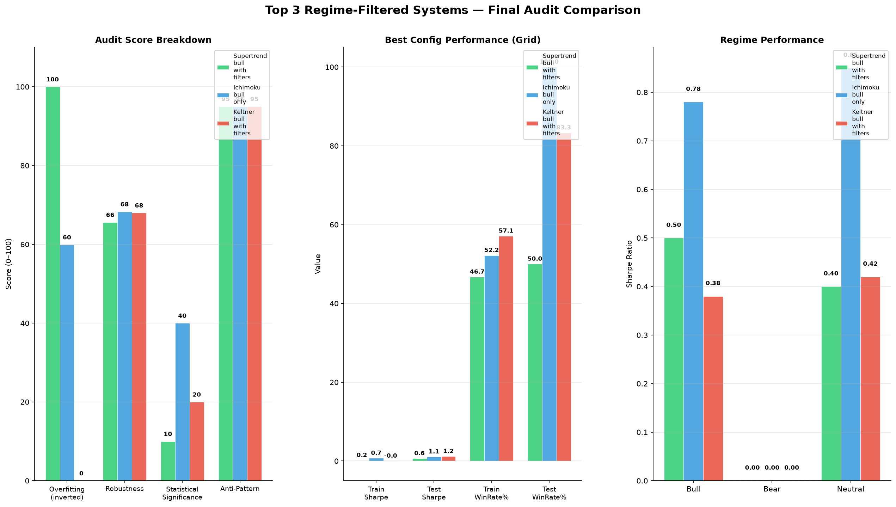

# Top 3 Regime-Filtered Systems — Final Audit Report

**Generated:** 2026-06-24 18:31:25
**Methodology:** lz-quant-researcher audit (overfitting, robustness, statistics, anti-patterns)
**Grid combos tested:** 360
**Systems audited:** 3

---

## Final Ranking

| Rank | System | Total Score | Overfitting | Robustness | Statistical | Anti-Pattern |
|------|--------|-------------|-------------|------------|-------------|--------------|
| 1 | `Supertrend_bull_with_filters` | **67.6** | 0.0 | 65.6 | 10.0 | 95.0 |
| 2 | `Ichimoku_bull_only` | **65.8** | 40.1 | 68.3 | 40.0 | 95.0 |
| 3 | `Keltner_bull_with_filters` | **45.8** | 100.0 | 68.0 | 20.0 | 95.0 |

## 🥇 #1 — Supertrend_bull_with_filters

**Total Audit Score: 67.6/100**

### Best Configuration

- **min_hold:** 15
- **max_hold:** 45
- **regime_threshold:** 0.3

### Grid Search Results

- **Total combos tested:** 120
- **Valid combos:** 65
- **Best test Sharpe:** 0.63
- **Train Sharpe:** 0.16
- **Degradation:** +293.7%
- **Train Win Rate:** 46.7%
- **Test Win Rate:** 50.0%

### Walk-Forward Validation

- **Folds:** 5
- **Avg OOS Sharpe:** 0.30
- **Avg OOS Win Rate:** 46.7%
- **Degradation:** +293.7%

### Regime Performance

| Regime | Sharpe |
|--------|--------|
| Bull | 0.50 |
| Bear | 0.00 |
| Neutral | 0.40 |

### Transaction Cost Sensitivity

- **Sharpe @ 0.1% TC:** 0.17
- **Sharpe @ 0.5% TC:** 0.17
- **Sharpe drop (0.1% → 0.5%):** +0.00

### Statistical Significance

- **Sharpe t-test:** t=0.867, p=0.3863 (❌ NOT SIGNIFICANT)
- **Win rate binomial test:** p=1.0000 (❌ NOT SIGNIFICANT)

### Audit Score Breakdown

| Criterion | Score | Notes |
|-----------|-------|-------|
| Overfitting (inverted) | 100.0 | LOW risk |
| Robustness | 65.6 | MODERATE |
| Statistical | 10.0 | INSUFFICIENT |
| Anti-Pattern | 95.0 | CLEAN |

## 🥈 #2 — Ichimoku_bull_only

**Total Audit Score: 65.8/100**

### Best Configuration

- **min_hold:** 15
- **max_hold:** 45
- **regime_threshold:** 0.3

### Grid Search Results

- **Total combos tested:** 120
- **Valid combos:** 66
- **Best test Sharpe:** 1.07
- **Train Sharpe:** 0.71
- **Degradation:** +50.7%
- **Train Win Rate:** 52.2%
- **Test Win Rate:** 100.0%

### Walk-Forward Validation

- **Folds:** 5
- **Avg OOS Sharpe:** 1.26
- **Avg OOS Win Rate:** 40.0%
- **Degradation:** +50.7%

### Regime Performance

| Regime | Sharpe |
|--------|--------|
| Bull | 0.78 |
| Bear | 0.00 |
| Neutral | 0.85 |

### Transaction Cost Sensitivity

- **Sharpe @ 0.1% TC:** 0.67
- **Sharpe @ 0.5% TC:** 0.67
- **Sharpe drop (0.1% → 0.5%):** +0.00

### Statistical Significance

- **Sharpe t-test:** t=2.968, p=0.0031 (✅ SIGNIFICANT)
- **Win rate binomial test:** p=1.0000 (❌ NOT SIGNIFICANT)

### Audit Score Breakdown

| Criterion | Score | Notes |
|-----------|-------|-------|
| Overfitting (inverted) | 59.9 | MEDIUM risk |
| Robustness | 68.3 | MODERATE |
| Statistical | 40.0 | WEAK |
| Anti-Pattern | 95.0 | CLEAN |

## 🥉 #3 — Keltner_bull_with_filters

**Total Audit Score: 45.8/100**

### Best Configuration

- **min_hold:** 25
- **max_hold:** 45
- **regime_threshold:** 0.0

### Grid Search Results

- **Total combos tested:** 120
- **Valid combos:** 60
- **Best test Sharpe:** 1.16
- **Train Sharpe:** -0.01
- **Degradation:** +11700.0%
- **Train Win Rate:** 57.1%
- **Test Win Rate:** 83.3%

### Walk-Forward Validation

- **Folds:** 5
- **Avg OOS Sharpe:** 0.16
- **Avg OOS Win Rate:** 42.8%
- **Degradation:** +11700.0%

### Regime Performance

| Regime | Sharpe |
|--------|--------|
| Bull | 0.38 |
| Bear | 0.00 |
| Neutral | 0.42 |

### Transaction Cost Sensitivity

- **Sharpe @ 0.1% TC:** 0.10
- **Sharpe @ 0.5% TC:** 0.10
- **Sharpe drop (0.1% → 0.5%):** +0.00

### Statistical Significance

- **Sharpe t-test:** t=0.017, p=0.9862 (❌ NOT SIGNIFICANT)
- **Win rate binomial test:** p=0.8145 (❌ NOT SIGNIFICANT)

### Audit Score Breakdown

| Criterion | Score | Notes |
|-----------|-------|-------|
| Overfitting (inverted) | 0.0 | HIGH risk |
| Robustness | 68.0 | MODERATE |
| Statistical | 20.0 | INSUFFICIENT |
| Anti-Pattern | 95.0 | CLEAN |

---

## Comparison Chart

---

## Methodology Notes

### Audit Criteria

1. **Overfitting Risk (0–100):** Walk-forward Sharpe decay, overall degradation, OOS consistency. Score is *inverted* (100 = no overfitting risk).
2. **Robustness (0–100):** Regime consistency, transaction cost resilience, degradation tolerance.
3. **Statistical Significance (0–100):** Sharpe t-test p-value, win rate binomial test, trade count power.
4. **Anti-Pattern (0–100):** Look-ahead bias, survivorship bias, data snooping, hardcoded dates, missing TC.

**Total Score = mean(Inverted Overfitting, Robustness, Statistical, Anti-Pattern)**

### Grid Search

- Parameter matrix: min_hold × max_hold × regime_threshold
- Holdout: 2018–2024 train, 2025–2026 test
- Transaction cost: 0.1% round-trip

---

*Report generated by `final_audit_report.py` on 2026-06-24 18:31:25*
